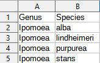
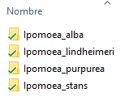
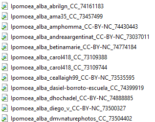

# Inat_Images

#### [](https://doi.org/10.5281/zenodo.4725852) 

Script to download images from inaturalist.org

1.- Clone this repository using `git clone https://github.com/ghuertaramos/Inat_Images.git` or download directly clicking [here](https://github.com/ghuertaramos/Inat_Images/archive/refs/heads/master.zip)

2.- Make a species list on a csv file named *species.csv* (see the sample file [here](./species.csv))



3.- Run the script on the command line. (You must have R, *rinat* and the *argparse* packages installed, the script tries to install and load the packages,  but if you have a problem install them manually) 

inat_images.R [-h] [-o OBSERVATIONS] [-q QUALITY] [-l LICENSE] [-s SIZE] [-y YEAR] [-m MONTH] [-d DAY] [-b BOUNDS]

` -h`, `--help` - Show **help** message and exit

`-o` , `--observations` - The maximum number of results to return [default "100"], limited to 10000, keep in mind this is before filtering

` -q `, `--quality`  - **Quality grade** [default "Research"]

- `Research` - Filters results to download only "ResearchGrade" observations

- `All_Q`      -  Results include "Needs_id" and "Casual"  observations

`-l `, `--license`  - **License type** [default "NonCC"]

- `Wikicommons` - include only photos with a license acceptable to WikiCommons  (i.e., CC-0, CC-BY, CC-BY-SA). Unfortunately, this filter greatly decreases the amount of pictures you can retrieve since most images have a "CC-BY-NC" license
- `NonCC` - Excludes images with "CC" copyright
- `All_L`  - Downloads all license types

`-s `, `--size`  - **Image size** [default "Medium"]

- `Small`  - Maximum width or length = 240px
- `Medium`  - Maximum width or length =500px
- `Large`  - Maximum width or length =1024px
- `Original`  - Maximum width or length =2048px

`-y` , `--year`  - Return observations for a given **year** (can only be one year) [default "None"]

`-m`  `--month` - Return observations for a given **month**, must be numeric, 1-12 [default "None"]

` -d `, `--day`   - Return observations for a given **day** of the month, 1-31 [default "None"]

` -b `,` --bounds`  - A txt file with **box** of longitude (-180 to 180) and latitude (-90 to 90). See [bounds.txt](./bounds.txt) sample file [default "None"]

You could run commands like the following:


```bash
Rscript inat_images.R -o 2000 -q All_Q -l Wikicommons
```

This would make a query for a maximum of 2000 research grade observations and then filter the results to download only images with a license compatible with Wikicommons

```bash
Rscript inat_images.R -o 500 -l All_l -y 2015 -b bounds.txt
```

This would make a query for a maximum of 500 research grade observations including all license types, from the year 2015 and use the coordinates on *bounds.txt* to filter results 

4.- If everything goes well you should have a folder for each species from your list



5.- Image file names are formatted as follows: `species_user_license_observation-id.jpeg`



6.- A file *inat_data.csv* with the results of your query will be saved, this files include various information like :species, date, url, coordinates, user, etc.

# Notes


Depending on the intended use of the images, be aware of license properties and limitations, some licenses require attribution, asking the original holder for permission to reuse, etc. See [creativecommons]( https://creativecommons.org/licenses/?lang=en) and [iNaturalist help page](https://www.inaturalist.org/pages/help)  for more information.

In order to comply with iNaturalist [citation policy](https://www.inaturalist.org/pages/help#cite), it is important to include in your publication some sort of table/appendix with a link to each of the  observations. You could base this table on the *inat_data.csv* output file.

The script has some time restrictions to be able to comply with iNaturalist query limits. There is a  max of 100 requests per minute,  though it is recommended to reduce usage to 60 requests per minute or lower. There is a hard limit of 10,000 observations with the iNaturalist API per species per query.  Be aware that bulk download may severely impact server usage.  Downloading over 5 GB of media per hour or 24 GB of media per day may  result in a permanent block. Consider supporting [iNaturalist.org](https://www.inaturalist.org/donate?utm_medium=web&utm_source=iNaturalist)


# Citations

Guillermo Huerta-Ramos, & Roman Luštrik.  (2021, April 28). Inat_Images: v.1 (Version 1.0). Zenodo.  http://doi.org/10.5281/zenodo.4725852

Vijay Barve & Edmund Hart (2014). rinat: Access iNaturalist data through APIs. R package version 0.1.8.